<div align="center">

# ◆ PropMind

### AI Real Estate Intelligence Platform

**Predict prices · Discover explained matches · Ask an AI advisor · Chat with your property documents**


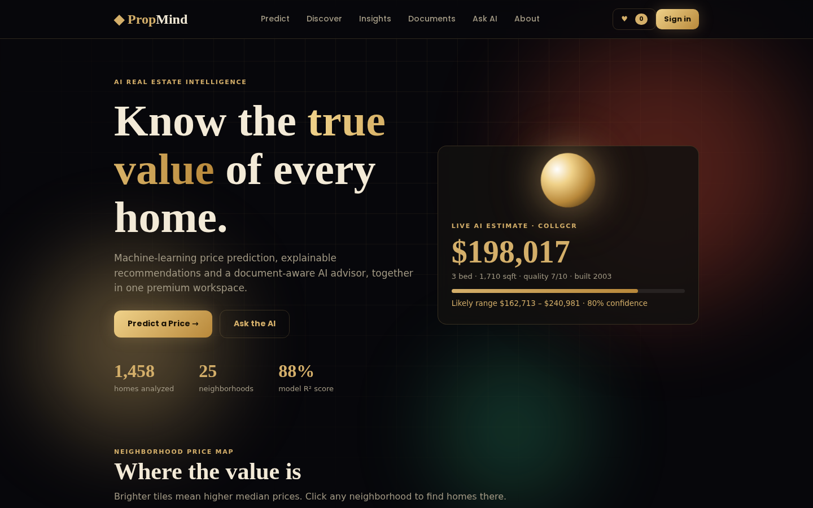

</div>

---

## Table of contents

1. [About the project](#about-the-project)
2. [Key features](#key-features)
3. [Product tour](#product-tour)
4. [System architecture](#system-architecture)
5. [How it works](#how-it-works)
6. [Model results](#model-results)
7. [Tech stack](#tech-stack)
8. [Getting started](#getting-started)
9. [API reference](#api-reference)
10. [Deployment](#deployment)
11. [Project structure](#project-structure)
12. [Troubleshooting](#troubleshooting)
13. [Limitations and roadmap](#limitations-and-roadmap)
14. [Dataset, acknowledgments and license](#dataset-acknowledgments-and-license)

---

## About the project

Buying a home means answering three questions with very little reliable help: *What is this property really worth? Which homes fit me, and why? What do the legal and financial documents actually say?*

**PropMind** answers all three in one product. It combines data analysis, machine learning, generative AI and retrieval-augmented generation (RAG) behind a FastAPI backend and a premium dark-luxury web interface. It was built as the final project for the AI and Data Science course at SMIT (Saylani Mass IT Training), and is designed as a real-world AI product rather than a standalone model.

## Key features

| | Feature | What you get |
|---|---|---|
| ◈ | **AI price prediction** | A Random Forest estimate from nine simple inputs, an 80% likely range, a confidence score and *what-if* effects ("+1 quality adds about $X") |
| ★ | **Explained recommendations** | Ranked homes by budget, location, bedrooms and preferences. Every result lists **why** it was recommended and how its price compares with the AI fair value |
| ✦ | **AI real estate advisor** | A Groq-powered chatbot with prompt engineering, market context, guardrails and conversation memory |
| ❏ | **Document RAG assistant** | Answers grounded in four real-world property documents (plus your own PDF/TXT/MD uploads) with `[1]` citations and source passages |
| ▥ | **Market insights** | Interactive neighborhood rankings, model comparison and eight analysis charts |
| ♥ | **Shortlist, compare and report** | Save favourites, compare up to three homes side by side, download a PDF valuation report, keep valuation and chat history |
| ⚙ | **Production touches** | Demo login, offline fallback when no API key is set, input validation, CORS, 10 automated tests, static build for Firebase |

## Product tour

| Price prediction | Smart recommendations |
|---|---|
| 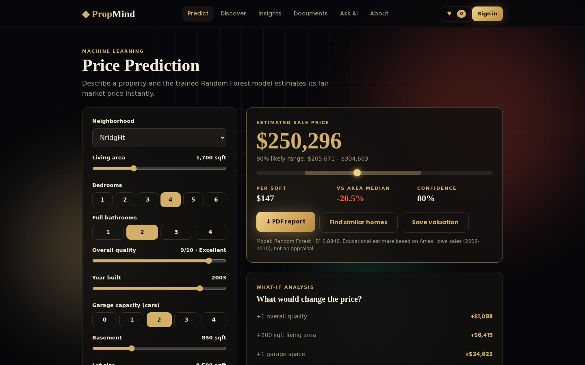 | 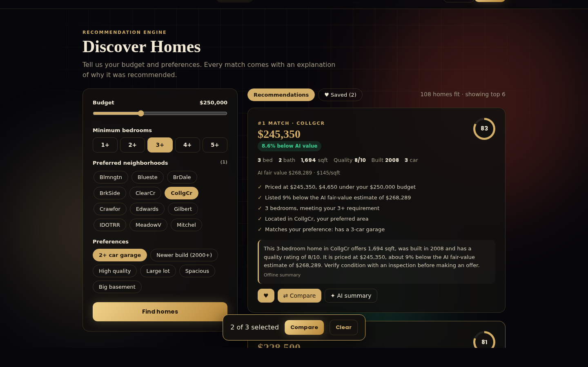 |

| Compare homes | Market insights |
|---|---|
| 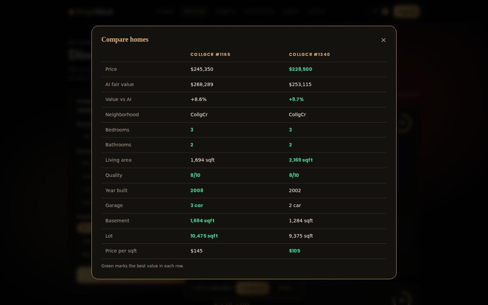 | 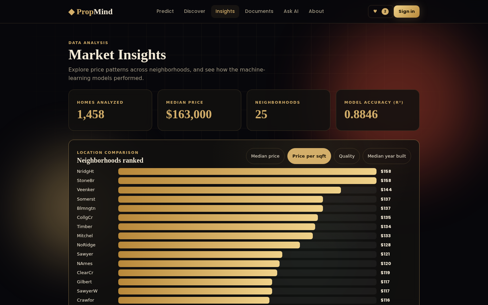 |

| Document RAG assistant | AI advisor |
|---|---|
| 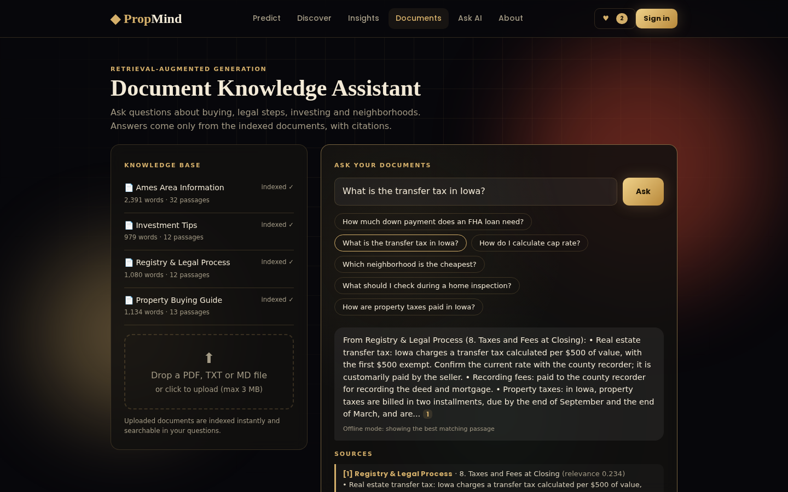 | 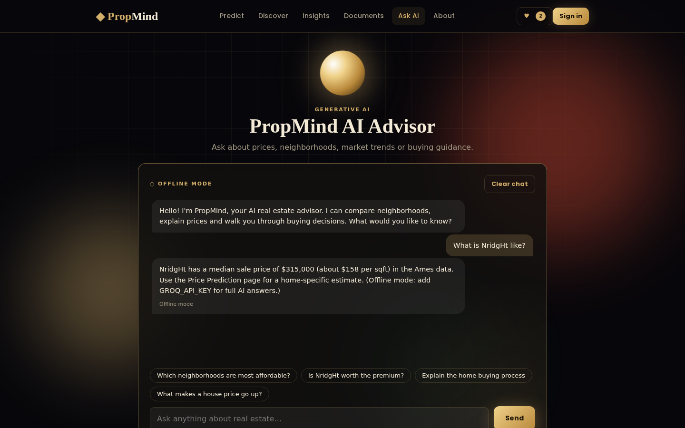 |

> Screenshots were captured without a Groq key, so the assistant shows its offline mode. With a key, answers are written by the LLM.

## System architecture

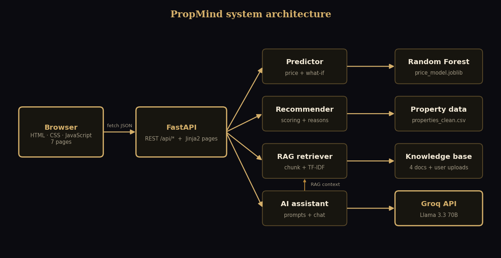

- The **browser** talks to FastAPI through a small JSON API (`/api/*`). The same FastAPI app also renders the seven Jinja2 pages.
- **Services** are plain Python modules (no web dependencies), so they are easy to test and reuse.
- The **assistant** builds prompts and calls the Groq API. If no key is configured, it degrades gracefully to an offline mode instead of failing.

## How it works

### 1. Data analysis and preprocessing
The Kaggle *Ames Housing* data (1,460 sales, 79 features) is cleaned with Pandas and NumPy: "NA" values that mean *feature absent* (pool, alley, garage) become `None`, genuine gaps are imputed (for example lot frontage by neighborhood median), two known outliers are removed, and new features (`TotalSF`, `HouseAge`, `PricePerSqft`) are engineered. The result is 1,458 homes with no missing values. Eight Matplotlib and Seaborn charts cover price distribution, location comparison, area vs price, quality, trend, correlations, predicted vs actual and feature importance.

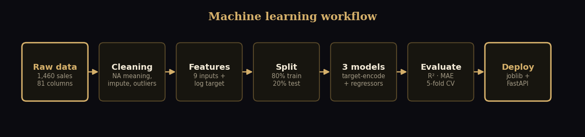

### 2. Machine-learning price model
Three models are compared on a held-out 20% test set: Linear Regression, Decision Tree and Random Forest. The target is `log(SalePrice)`. The neighborhood is **target-encoded** inside the pipeline (a plain one-hot encoding was almost ignored by the trees, which made neighborhood changes have no effect on predictions). The Random Forest is saved with `joblib` and served by the API.

### 3. Recommendation system
Candidates are filtered by budget, bedrooms and neighborhoods, then scored on **budget fit**, **value against the AI fair-value estimate**, build quality and preference matches (garage, newer build, quality, lot, size, basement). Each result carries plain-language reasons, for example *"Listed 9% below the AI fair-value estimate of $268,289"*.

### 4. Generative AI assistant
A structured system prompt defines the role, injects real market facts from the data, forbids invented statistics, requires a balanced view of risks, adds legal and financial disclaimers and caps answer length. Property summaries use a separate, data-only prompt.

### 5. RAG knowledge assistant

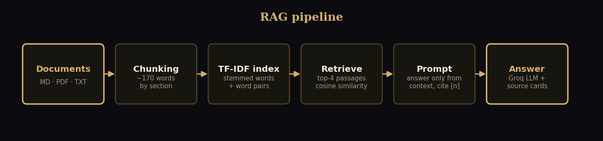

Documents are split by section into roughly 170-word passages and indexed with TF-IDF over lightly stemmed words and word pairs, with section titles weighted double. A question retrieves the top four passages; the LLM must answer **only** from them and cite `[n]`. If nothing relevant is found, the assistant says so instead of guessing. The knowledge base contains four documents: *Property Buying Guide*, *Registry and Legal Process* (Iowa), *Investment Tips* (with a worked cap-rate example) and *Ames Area Information* (generated from the dataset).

## Model results

Evaluated on 292 held-out homes:

| Model | R² | MAE | RMSE | 5-fold CV R² |
|---|---|---|---|---|
| Linear Regression | 0.876 | $18,829 | $26,144 | 0.859 |
| Decision Tree | 0.840 | $20,913 | $29,761 | 0.769 |
| **Random Forest (deployed)** | **0.885** | **$17,782** | **$25,251** | 0.847 |

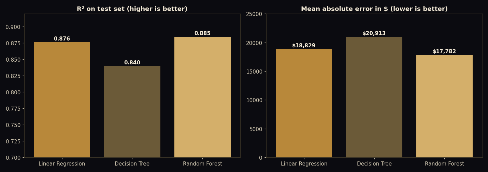

- **RAG retrieval:** on a 15-question evaluation set (`python ml/eval_retrieval.py`) the right document is ranked first for 15 of 15 questions (100%); a plain TF-IDF baseline reached 14 of 15 (93%).
- **63%** of predictions are within 10% of the real sale price, **77%** within 15% and **87%** within 20%. The median error is **6.6%**.
- The Random Forest has the best test R² and lowest error. Linear Regression has a slightly higher cross-validation R², so the margin between the two is small; the Random Forest was chosen for its lower error and its ability to capture non-linear effects such as the premium on high build quality.

## Tech stack

| Layer | Tools |
|---|---|
| Data and ML | Python, Pandas, NumPy, scikit-learn, Matplotlib, Seaborn, joblib |
| Backend | FastAPI, Pydantic, Jinja2, ReportLab, pypdf, httpx |
| GenAI and RAG | Groq API (Llama 3.3 70B), prompt engineering, TF-IDF retrieval |
| Frontend | HTML, CSS, vanilla JavaScript (no framework), Google Fonts |
| DevOps | GitHub, Vercel, Firebase Hosting |

## Getting started

### Prerequisites
Python 3.10 or newer and Git. A free [Groq API key](https://console.groq.com) is optional.

### Install and run

```bash
git clone https://github.com/<your-username>/propmind.git
cd propmind

python -m venv .venv
.venv\Scripts\activate            # Windows   (macOS/Linux: source .venv/bin/activate)
pip install -r requirements-dev.txt

python ml/train.py                # optional: retrain with your library versions
copy .env.example .env            # macOS/Linux: cp .env.example .env
uvicorn app.main:app --reload
```

Open **http://127.0.0.1:8000**. Interactive API docs are at **/docs**.

### Environment variables

| Variable | Required | Description |
|---|---|---|
| `GROQ_API_KEY` | No | Enables full AI answers. Without it the assistant runs in offline mode |
| `GROQ_MODEL` | No | Defaults to `llama-3.3-70b-versatile` |

### Notebook and tests

```bash
jupyter notebook notebooks/PropMind_Analysis.ipynb     # or open it in VS Code and Run All
python tests/test_core.py                              # or: python -m pytest -q
```

The saved notebook already contains every output and chart.

## API reference

| Method | Endpoint | Purpose |
|---|---|---|
| GET | `/api/health` | Status, model name and AI mode |
| GET | `/api/meta` | Neighborhoods, preference keys, model metrics |
| POST | `/api/predict` | Price estimate, range, confidence, what-if |
| POST | `/api/recommend` | Ranked homes with reasons |
| GET | `/api/properties?ids=1,2` | Property details by id |
| POST | `/api/summary` | AI summary of one property |
| POST | `/api/chat` | General AI advisor |
| POST | `/api/rag/ask` | Answer from documents, with sources |
| GET | `/api/rag/docs` | List indexed documents |
| POST | `/api/rag/upload` | Upload a PDF, TXT or MD document |
| GET | `/api/insights` | Neighborhood statistics |
| POST | `/api/report` | Download a PDF valuation report |

Example:

```bash
curl -X POST http://127.0.0.1:8000/api/predict \
  -H "Content-Type: application/json" \
  -d '{"GrLivArea":1710,"BedroomAbvGr":3,"FullBath":2,"OverallQual":7,"YearBuilt":2003,"GarageCars":2,"TotalBsmtSF":856,"LotArea":8450,"Neighborhood":"CollgCr"}'
```

## Deployment

The backend and website run together on **Vercel**. The same website can also be hosted on **Firebase Hosting** as a static frontend that calls the Vercel API. Neither free plan needs a billing card.

### 1. GitHub

```bash
git init && git add .
git commit -m "PropMind: AI Real Estate Intelligence Platform"
git branch -M main
git remote add origin https://github.com/<your-username>/propmind.git
git push -u origin main
```

### 2. Vercel (backend and website)

1. On vercel.com choose **Add New → Project** and import the repository.
2. Set the framework preset to **Other** and leave the build settings empty.
3. Add the environment variable `GROQ_API_KEY`.
4. Deploy. The site and API are live at `https://<project>.vercel.app`.

`vercel.json`, `index.py` and `.vercelignore` are already configured. Vercel functions are stateless, so documents uploaded from the web page can disappear between requests; the four built-in documents always remain. If the bundle exceeds Vercel's size limit, deploy the same repository on Render or Hugging Face Spaces.

### 3. Firebase Hosting (static frontend)

```bash
npm install -g firebase-tools
firebase login
copy .firebaserc.example .firebaserc       # put your Firebase project id inside
python ml/build_static.py --api https://<project>.vercel.app
firebase deploy --only hosting
```

## Project structure

```
propmind/
├── app/
│   ├── main.py                  FastAPI app: pages and JSON API
│   ├── services/                predictor, recommender, rag, assistant, llm, prompts
│   ├── templates/               base + 7 pages (Jinja2)
│   └── static/                  css/, js/, charts/
├── data/                        train.csv (Kaggle) and properties_clean.csv
├── docs/                        4 RAG documents, images/, screenshots/
├── ml/                          train.py, make_area_doc.py, make_report_figures.py,
│                                build_notebook.py, build_static.py
├── models/                      price_model.joblib, model_stats.json, final_eval.json
├── notebooks/                   PropMind_Analysis.ipynb
├── reports/                     report (DOCX+PDF), presentation (PPTX+PDF), README (PDF)
├── tests/test_core.py
├── index.py, vercel.json        Vercel entrypoint
├── firebase.json                Firebase Hosting config
└── requirements.txt, requirements-dev.txt, .env.example
```

## Troubleshooting

| Problem | Fix |
|---|---|
| `ModuleNotFoundError` | Activate the virtual environment and run `pip install -r requirements-dev.txt` |
| Model loading error or version warning | Run `python ml/train.py` to rebuild the model with your installed scikit-learn |
| Chatbot says "Offline mode" | Create `.env` from `.env.example`, add `GROQ_API_KEY`, restart the server |
| Pages load but show "Is the API running?" | Open the site through `http://127.0.0.1:8000`, not by double-clicking an HTML file |
| Port 8000 already in use | Run `uvicorn app.main:app --reload --port 8001` |
| Uploaded document disappears (on Vercel) | Expected on stateless hosting; add it again or keep it in `docs/` |

## Limitations and roadmap

**Limitations.** The model learns from one city and the years 2006-2010 and uses nine inputs, so estimates are educational, not appraisals. The legal and investment documents are general educational material, not legal, tax or financial advice. Demo accounts live only in the visitor's browser. TF-IDF retrieval matches words, not meaning.

**Roadmap.**
- Embedding-based retrieval with a vector database for semantic search
- Real accounts and saved data with Firebase Authentication and Firestore
- Gradient boosting models and a larger, more recent dataset
- Map view with listing photos and an image-based condition score
- Multilingual interface (English and Urdu)

## Dataset, acknowledgments and license

- **Dataset:** [House Prices: Advanced Regression Techniques](https://www.kaggle.com/c/house-prices-advanced-regression-techniques) (Kaggle, MIT license), based on the Ames Housing data compiled by Dean De Cock.
- **Built with** FastAPI, scikit-learn, Groq and the open-source Python ecosystem.
- **License:** MIT. See [LICENSE](LICENSE).

<div align="center">

**Built by Anushay Ayat** · AI and Data Science, SMIT (Saylani Mass IT Training)

</div>
